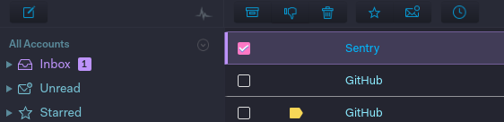

# Mailspring Dracula Theme

The Mailspring Dracula Theme is based on [Dracula](https://draculatheme.com/nylas-n1) and [Mailspring-Theme-Starter](https://github.com/Foundry376/Mailspring-Theme-Starter), the basic starting point for creating a theme for
the [Mailspring](http://www.getmailspring.com/) email client.

<h1 align="center"></div>

## Getting Started

Installing the theme in Mailspring is easy! Here's how you can do it.

1. Fork this repo or download the code.

2. Open Mailspring  and install the theme by going to `Mailspring > Install New Theme...`
   and selecting the directory.


## Structure

```
.
├── styles                 # All stylesheets
|   ├── index.less         # Main LESS file to import the stylesheets
│   ├── ui-variables.less  # UI variables that override N1's defaults
├── package.json           # Metadata about the theme
├── LICENSE.md             # License with usage rights
└── README.md              # Info about the theme and how to use it
```
